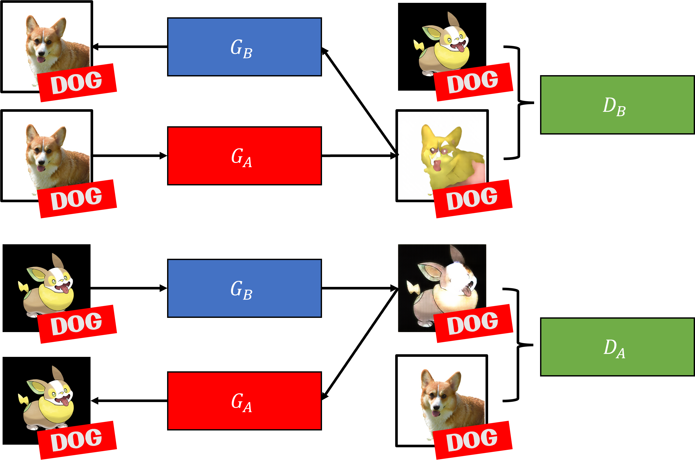

# ADL-Pokify-GAN

The proposed Generative Adversarial Networks (GAN) is a conditional Generative Adversarial Networks (cGAN) based on CycleGAN. The main difference is that we will be passing the labels such that the discriminator can compare the generated pokemon with a real pokemon that belongs to the same type of animal.

## Evaluation

'' Add in the evaluation result here ''

## Getting Started

### Links to download pretrained-model and datasets

Link to dataset for CycleGAN: [HERE](https://drive.google.com/file/d/1QHY-0eYQYZe_u9keyIkSYFyldKgUBEiL/view?usp=share_link)

Link to dataset for StyleGAN: [HERE](https://drive.google.com/file/d/14mobZsxAOyG4wlYxPeHHTIw7JuBEnycH/view?usp=share_link)

Link to models: [HERE](https://drive.google.com/file/d/1Dry20HKoD7-oiXlKVs-dkKg1AcYKPk4T/view?usp=share_link)

### Preparing Dataset

For cGAN, `dataset.json` is required, but need to delete the file if using the normal GAN.

Move the dataset to folders:

1. StyleGAN: **DO NOT** unzip `pkmn_label.zip`, move to `./stylegan/datasets`.

2. CycleGAN: Unzip `dataset_cyclegan.zip`. Move`trainA` and `trainB` to `./cyclegan/train_datasets`. To test images, create another folder call `testA`.

### Preparing Pre-trained Models

Move the model to folders:

1. StyleGAN: `stylegan_conditional.pkl` and `stylegan_unconditional.pkl` to `./stylegan/training_runs`.

2. CycleGAN: `animal2pkmn_cond`, `animal2pkmn_new` and `animal2pkmn_xavier` to `./cyclegan/checkpoints`.

### Using the Models

Refer to respective Jupyter Notebook file. `StyleGAN.ipynb` and `CycleGAN.ipynb`.

## References

Karras, T., Aittala, M., Hellsten, J., Laine, S., Lehtinen, J., & Aila, T. (2020). Training Generative Adversarial Networks with Limited Data. Proc. NeurIPS. Available at: https://github.com/NVlabs/stylegan2-ada-pytorch.

Zhu, J.-Y., Park, T., Isola, P., & Efros, A. A. (2017). Unpaired Image-to-Image Translation using Cycle-Consistent Adversarial Networks. Computer Vision (ICCV), 2017 IEEE International Conference On. Available at: https://github.com/junyanz/pytorch-CycleGAN-and-pix2pix
